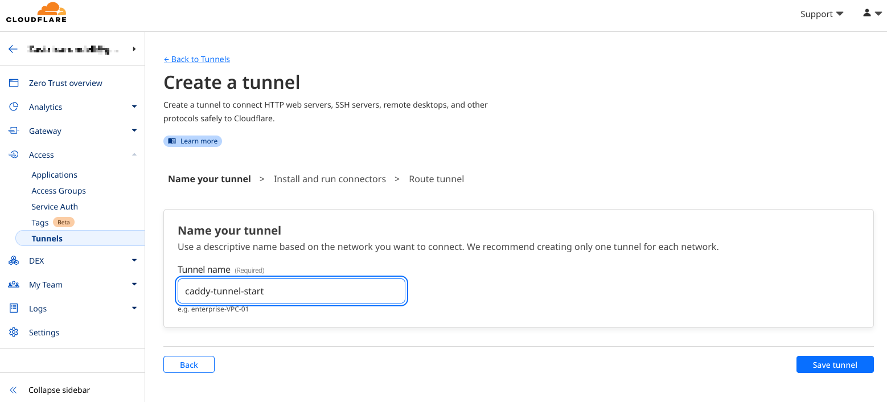
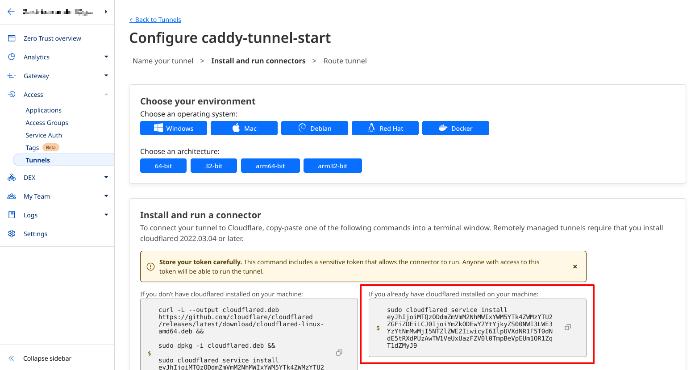
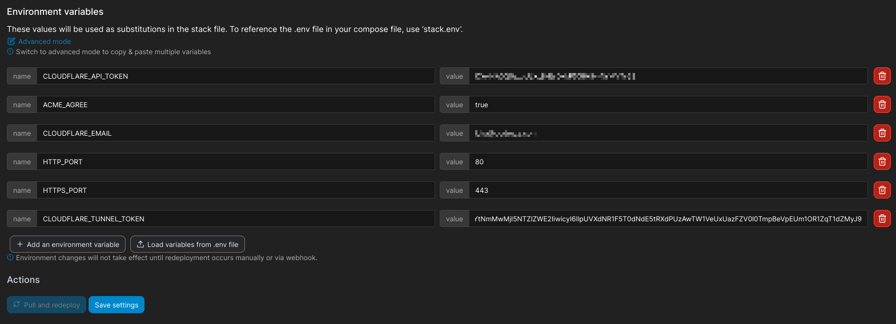
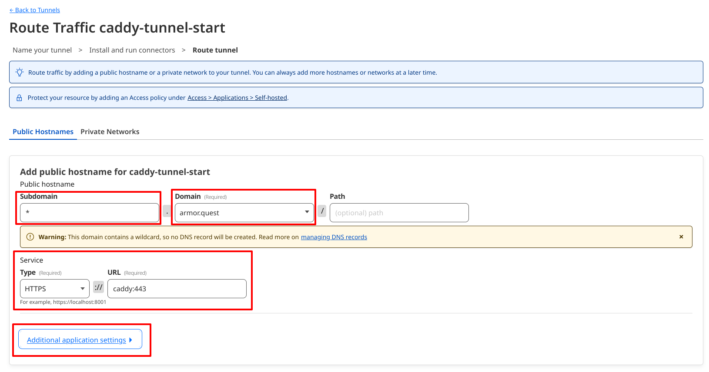
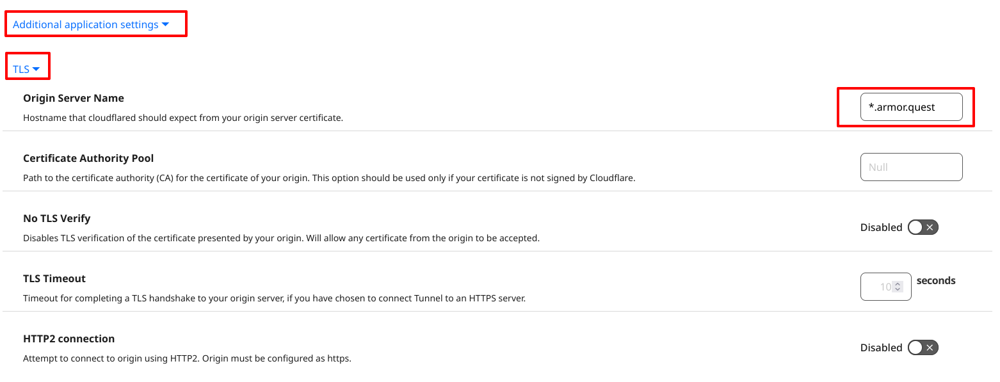
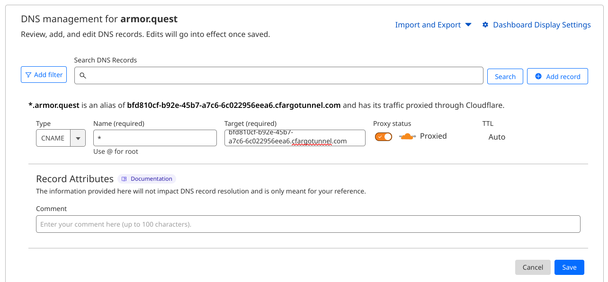

# Caddy cloudflare setup

This is a setup meant mostly for potainer. It's an example (which I do use though) for using Caddy + Cloudflare DNS + Cloudflared tunnels for my local websites.

## How is it meant to work?

Essentially you add this as a git stack under portainer and set some environment variables and hopefully it should work, you will need to changes on your cloudflare dashboard though.

## Setting up cloudflare tunnels

Cloudflare moved into using remote-managed tunnels so you can't create a config file for it, you have to use the dashboard. Enter the zero access dashboard and then Access > Tunnels.

This guide is mostly focus on wildcard records.

Let's start the tunnel creation process. Firstly, name your tunnel:



After that we need to get the tunnel token. Copy the highlighted section, paste in a text editor and only select the token:



Now set your `CLOUDFLARE_TUNNEL_TOKEN` env variable. I'm using portainer so I have a nice GUI for it:



Now we have to configure the Public Hostnames for our tunnel. But in `*` for `Subdomains`, `Domain` should be your, well, Domain. Don't worry about the warning, we'll take care of it later.

`Service.Type` should be `HTTPS` and `Service.URL` should be `caddy:443`. After that press `Additional application settings`:



After opening the new menu head into `Additional application settings` > `TLS` > `Origin Server Name` and set it to the combination of your subdomain and domain, in my case: `*.armor.quest`:



Hit save and then you should see your tunnel being active:


Great! Let's copy the ID of the tunnel, in my case: `bfd810cf-b92e-45b7-a7c6-6c022956eea6` and let's go to the DNS settings for the domain. You need to create a `CNAME` record for `<id>.cfargotunnel.com`:





And with this the cloudflare is *communicating* with the caddy server!


... But it still doesn't work, WHY?!


And the corresponding `cloudflared` logs:

```
02T12:03:16Z ERR  error="Unable to reach the origin service. The service may be down or it may not be responding to traffic from cloudflared: remote error: tls: internal error" cfRay=82f36cf98a75b33f-PRG event=1 ingressRule=0 originService=https://caddy:443

2023-12-02T12:03:16Z ERR Request failed error="Unable to reach the origin service. The service may be down or it may not be responding to traffic from cloudflared: remote error: tls: internal error" connIndex=1 dest=https://vencloud.armor.quest/metrics event=0 ip=198.41.192.77 type=http
```

Well, it's because caddy isn't accepting the request. It gets it, it just declines it. We have to change up our caddyfile a bit:

If this is our Caddyfile:

```
(cloudflare) {
    encode gzip
    tls {
        dns cloudflare {env.CLOUDFLARE_API_TOKEN}
    }
}

nextcloud.armor.quest {
    import cloudflare
    reverse_proxy 192.168.0.143:9351
}

vault.armor.quest {
    import cloudflare
    redir /admin* /
    reverse_proxy 192.168.0.143:8087
}

vencloud.armor.quest {
    import cloudflare
    reverse_proxy 192.168.0.143:7951
}
```

We'll need to modify it to accept `*.armor.quest` and then reverse proxy on every service:

```
(cloudflare) {
    encode gzip
    tls {
        dns cloudflare {env.CLOUDFLARE_API_TOKEN}
    }
}

*.armor.quest {
   import cloudflare

   @service1 host nextcloud.armor.quest
   reverse_proxy @service1 192.168.0.143:9351

   @service2 host vencloud.armor.quest
   reverse_proxy @service2 192.168.0.143:7951

   @service3 host vault.armor.quest
   redir /admin* /
   reverse_proxy @service3 192.168.0.143:8087
}
```